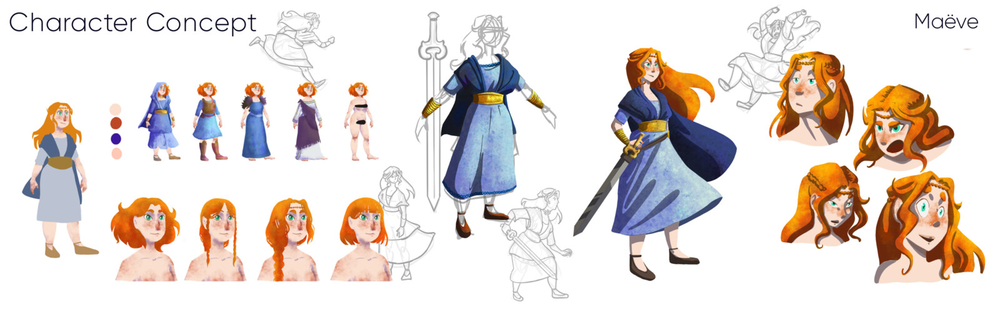
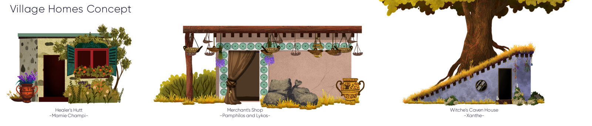
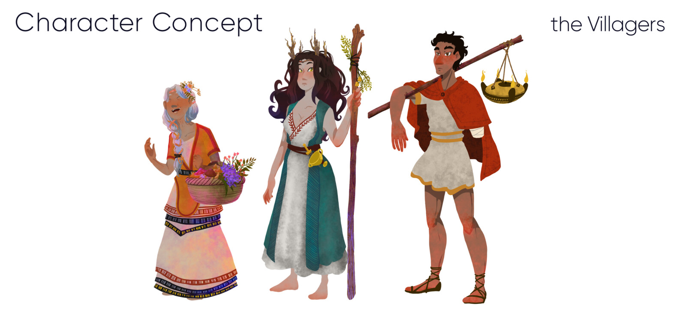

# Ballad-of-the-Wicked

:fr: Jeu vidéo 2D en cours de développement par un developpeur et une illustratrice de métier. Bien que l'idée générale du jeu soit définie, tous les aspects du jeu sont encore en développement. Actuellement, nous travaillons sur les mécaniques de jeu, la conception des niveaux, ainsi que sur d'autres aspects tels que les personnages, les ennemis, les objets et la narration.
:gb: 2D video game in development by a developer and an illustrator by trade. Although the general idea of the game is defined, all aspects of the game are still in development. Currently, we are working on game mechanics, level design, as well as other aspects such as characters, enemies, objects and narrative.

